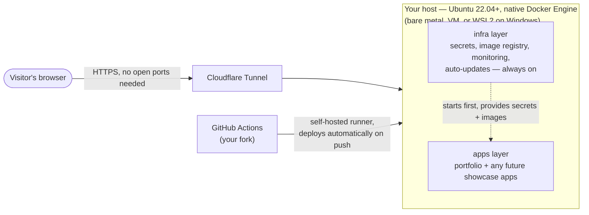

# Deployment Guide

This guide documents how to deploy the Systems Playground onto a self-managed Ubuntu host, leveraging automated startup scripts, Cloudflare Tunnels, and Watchtower for CI/CD.

**Who this is for:** you have (or are about to make) your own fork of this repo and want to deploy it as your own running instance. Every command below deploys *your* copy — nothing here talks to the original author's server.

**About the target host:** everything below is written for **any Ubuntu 22.04+ host** — bare metal, a VM, a cloud instance, or WSL2 on Windows. None of the core deployment steps (sections 0, 1, 3) are WSL-specific or Windows-specific at all — `bootstrap.sh` explicitly has no WSL branch, since WSL2 runs a real Linux kernel and installs everything the same way a native host does (see [ADR 003](adrs/003-native-docker-engine-over-docker-desktop.md)). The one genuinely Windows/WSL2-specific piece is boot automation (section 2), since Windows doesn't have `systemd` — that section branches by host type, and there's a dedicated [Windows/WSL2-Specific Notes](#windowswsl2-specific-notes) section at the end for anything else Windows-only. This project's own reference deployment happens to run on WSL2 (a NUC-class mini PC), which is why you'll see it mentioned as a concrete example throughout — but nothing here requires it.

## Before You Start

The big picture: your host runs everything. Nothing is exposed by opening router ports; a Cloudflare Tunnel makes an outbound-only connection from your host to Cloudflare, and Cloudflare routes public traffic back down that tunnel to whichever local port your service is listening on.



**What you'll need before starting:**

- **An Ubuntu 22.04+ host.** Bare metal, a VM, a cloud instance, or WSL2 on Windows all work identically for sections 0, 1, and 3 below. If you're going the WSL2 route and haven't set it up yet, follow [Microsoft's official WSL install guide](https://learn.microsoft.com/en-us/windows/wsl/install) first — this doc picks up from there either way. No exact minimum hardware is specified in this repo, but the whole "scale-to-zero" design (see [ADR 001](../self-host/apps/portfolio/adrs/001-custom-go-control-plane.md)) exists specifically to keep steady-state resource use low, so modest hardware (a few GB of free RAM and disk) is enough to get started.
- **Your own fork of this repo** on GitHub (needed for section 3 — the CI/CD runner deploys from your fork, not the original).
- **A domain name you control, added to a free Cloudflare account.** You'll point subdomains of it at your services in section 1 — you can't complete that section without this.
- Comfort with a Linux terminal is helpful but not required — nearly every mechanical step is scripted (section 0).

With those in hand, follow sections 0 through 3 below in order — each one has a "✅ Verify this worked" checklist at the end before you move to the next.

## The host

Everything in this guide deploys onto **the host**: any Ubuntu 22.04+ machine — bare metal, a VM, a cloud instance, or WSL2 on Windows (this project's own reference host happens to be the latter, currently a NUC-class mini PC, but nothing below depends on that). Docker runs as a native Docker Engine installed directly on that host (see [ADR 003](adrs/003-native-docker-engine-over-docker-desktop.md) for why this isn't Docker Desktop's WSL2 integration on a Windows host), and a self-hosted GitHub Actions runner (a small agent that lets *your* GitHub Actions workflows run commands directly on your host — see section 3) also runs there. The rest of this doc just says "the host" from here on. If your host is Windows/WSL2 specifically, see [Windows/WSL2-Specific Notes](#windowswsl2-specific-notes) at the end of this doc for the handful of things that only apply to that setup.

## Architecture: `infra` vs `apps`
A robust local host environment separates core infrastructure from application workloads — this mirrors the in-repo split between `self-host/infra/` (platform-wide services) and `self-host/apps/` (showcase projects like the portfolio). This is the **deployed** layout on the host; two required repository variables control it, `INFRA_BASE_DIR` and `APP_BASE_DIR` — neither has a default, every deploy workflow fails fast if its own is unset.

```text
$INFRA_BASE_DIR (e.g. /home/yizhe/infra)          
├── wsl-startup.sh                                
├── wsl-shutdown.sh                                    
├── .env                                                
├── infisical/            (starts first — everything else depends on it for secrets)
│   └── docker-compose.yml
├── registry/             (starts second — services below pull their image from here)
│   └── docker-compose.yml
├── uptime-kuma/                                        
│   └── docker-compose.yml                              
├── watchtower/
│   └── docker-compose.yml
├── filebrowser/
│   └── docker-compose.yml
├── n8n/
│   └── docker-compose.yml
└── ...                   (any subdirectory with a docker-compose.yml is auto-discovered)

$APP_BASE_DIR (e.g. /home/yizhe/apps)
├── portfolio/
│   ├── docker-compose.yml
│   ├── docker-compose.override.yml
│   ├── frontend/.env
│   └── backend/.env
└── ...                   (each future app gets its own top-level directory here)
```

*   **`$INFRA_BASE_DIR`**: platform-wide services — the secrets manager (`infisical`), the self-hosted image registry (`registry`), Cloudflare (`cloudflared`, installed directly on the host, not containerized), monitoring (`uptime-kuma`), auto-updates (`watchtower` — watches for newer container image versions and restarts affected services automatically), shared storage (`filebrowser`), automation (`n8n`), and whatever gets added next. `wsl-startup.sh`/`wsl-shutdown.sh` boot/stop this whole layer as a group and auto-discover new services by directory — nothing here needs to be registered by name, so this list will grow without needing a script change (see [the scripts README](../self-host/infra/scripts/README.md) for the two services that are special-cased for startup order, and why).
*   **`$APP_BASE_DIR`**: the actual showcase applications (`portfolio`, and any future ones — named after the app itself, e.g. `self-host/apps/<app-slug>`, not the `systems-playground` repo they all live in). These come online *after* the infra layer, and don't have a shared startup/shutdown script — each relies on its own `restart: unless-stopped` policy to survive a reboot.

**In-repo source of these files:** `wsl-startup.sh`/`wsl-shutdown.sh` live at `self-host/infra/scripts/`, copied flat into `$INFRA_BASE_DIR/` by `deploy-infra-scripts.yml`. Every other infra service's compose file is copied the same way by its own `deploy-infra-<slug>.yml` into `$INFRA_BASE_DIR/<slug>/`. The portfolio app's compose files are copied by `deploy-app-portfolio.yml` into `$APP_BASE_DIR/portfolio/` (from `self-host/apps/portfolio/` in the repo). There is no `/wsl-reference-setup` directory in this repo — `self-host/infra/` and `self-host/apps/` **are** the reference source.

---

## 0. Fresh Host Bootstrap

[`scripts/bootstrap.sh`](../scripts/bootstrap.sh) automates the mechanical, idempotent parts of getting a fresh Ubuntu-like host ready: installing `git`/`cloudflared` (and Docker Engine, on a native host — see below), cloning this repo, scaffolding `$INFRA_BASE_DIR`/`$APP_BASE_DIR`, and templating `~/.cloudflared/config.yml`. It's safe to re-run — every step checks current state first.

**Nothing needs to be cloned first.** The script clones the repo itself (step 4) if it isn't already present, so on a genuinely fresh host you can just download the one file and run it:

```bash
curl -fsSL -o bootstrap.sh https://raw.githubusercontent.com/yizhe1997/systems-playground/main/scripts/bootstrap.sh
REPO_URL=<your-fork-url> bash bootstrap.sh   # REPO_URL defaults to yizhe1997/systems-playground if omitted
```

If you already have the repo cloned, `make bootstrap` from the repo root works the same way and reuses that clone instead of creating a second one.

It pauses with printed instructions at the steps below that genuinely need a human: `cloudflared tunnel login` (browser auth), `cloudflared tunnel create`, and GitHub Actions runner registration (needs a fresh token from GitHub's UI each time). Re-run the script after completing each one. Sections 1 and 3 below describe what those manual steps are doing; the script exists so you don't have to hand-run the surrounding mechanical parts (installing `cloudflared`, writing the skeleton `config.yml`, downloading the runner binary) yourself.

**Docker is conditional, not WSL-specific:** the script checks whether `docker` already works before installing anything; if it doesn't, it installs Docker Engine directly (the same steps as [Docker's official apt instructions](https://docs.docker.com/engine/install/ubuntu/)) regardless of whether the host is WSL2 or bare-metal Ubuntu — WSL2 runs a real Linux kernel, so there's no reason to special-case it. See [ADR 003](adrs/003-native-docker-engine-over-docker-desktop.md) for why this used to route WSL hosts to Docker Desktop instead, and the note above this section for a gotcha if this host previously relied on Docker Desktop's WSL integration.

Infisical's admin/org/machine-identity setup and the Windows Task Scheduler entries (section 2) stay fully manual — see [`self-host/infra/infisical/README.md`](../self-host/infra/infisical/README.md#bootstrap-one-time-manual---cannot-be-automated-via-ci-since-nothing-else-can-authenticate-to-this-yet) for why the former can't be scripted.

**✅ Verify this worked:** run `docker --version` and `cloudflared --version` — both should print a version, not "command not found". Run `ls ~/infra ~/apps` — both directories should exist (empty for now; they get populated by the deploy workflows in section 3). If `bootstrap.sh` paused with a manual-step message instead of finishing, that's expected — follow that message, then re-run the script.

---

## 1. Cloudflare Tunnel Setup

To expose your local services securely without opening router ports, we use Cloudflare Tunnels (`cloudflared`). This is the only reverse-proxy layer in front of services — there is no nginx (or similar) in the request path. Cloudflare Tunnel's `ingress` config already does hostname- and path-based routing straight to each service's `localhost:<port>`, which is sufficient on its own; adding nginx would just be a second, redundant routing layer. (This host happens to also have a system `nginx` package installed, but it's unconfigured/unused — serves only the stock placeholder page on port 80, which nothing points at — a leftover from an earlier, abandoned approach. Don't wire anything through it.)

1. **Install cloudflared:** `make bootstrap` does this for you (or follow the [official Cloudflare documentation](https://developers.cloudflare.com/cloudflare-one/connections/connect-networks/get-started/create-local-tunnel/) to install it manually).
2. **Authenticate:** Run `cloudflared tunnel login`.
3. **Create a Tunnel:** Run `cloudflared tunnel create <your-tunnel-name>`. This generates a JSON credentials file.
4. **Configure Routing:** `make bootstrap` templates a starter `config.yml` in `~/.cloudflared/` (tunnel id + credentials-file + catch-all 404) once a tunnel exists — it never overwrites one that's already there. Add per-service `ingress` entries to it as you deploy each service.

### How to Bind Domains in `config.yml`
Here is an example configuration showing how to route public domains to the internal local ports. By default, the portfolio project (`self-host/apps/portfolio/docker-compose.yml`) uses:
*   **Frontend:** Container port `3000`, host port `8086`
*   **Backend API:** Container port `8080`, host port `8085`

```yaml
tunnel: <your-tunnel-id>
credentials-file: /home/user/.cloudflared/<your-tunnel-id>.json

ingress:
  # Example: Expose the Systems Playground Frontend
  - hostname: portal.yourdomain.com
    service: http://localhost:8086
    
  # Example: Expose the Systems Playground API
  - hostname: api.yourdomain.com
    service: http://localhost:8085
    
  # Catch-all for unmatched traffic
  - service: http_status:404
```

**Action Required in `self-host/apps/portfolio/docker-compose.yml`:**
If you want the frontend accessible at `portal.yourdomain.com` via port 8081, ensure the frontend mapping in `docker-compose.yml` (or `docker-compose.prod.yml`) is set to `"8081:3000"`.

```yaml
  frontend:
    ports:
      - "8081:3000" # Map host port 8081 to container port 3000
    environment:
      - NEXT_PUBLIC_API_URL=https://api.yourdomain.com
```

**✅ Verify this worked:** run `cloudflared tunnel list` — your tunnel name should appear. Run `cat ~/.cloudflared/config.yml` and confirm it has your tunnel's ID and at least the catch-all 404 entry. You won't be able to reach a hostname yet (nothing runs the tunnel process until section 2's startup script does), so don't worry if `https://yourdomain.com` doesn't respond yet — that's expected at this point.

---

## 2. Automating Boot

To make this truly act like a server, the startup/shutdown scripts need to trigger automatically when your host boots up or shuts down. How you wire that up depends on your host type — pick the subsection that matches yours.

Only the **infra** layer ships a startup/shutdown script pair in this repo (`self-host/infra/scripts/wsl-startup.sh` / `wsl-shutdown.sh`, deployed to `~/infra/`). It starts Docker, brings up every service under `~/infra/*/docker-compose.yml` (Infisical first since everything depends on it for secrets, then the self-hosted registry since services like n8n pull their image from it, then everything else), and connects the Cloudflare Tunnel. See [the scripts README](../self-host/infra/scripts/README.md) for the full ordering rationale. (Despite the `wsl-` prefix in the filenames — a holdover from when this repo only targeted WSL2 — the scripts themselves are plain bash with nothing WSL-specific in them; they run identically on native Ubuntu.)

### If your host is Windows/WSL2: Task Scheduler

This is the path actually running on this project's own reference host — verified working.

**Startup Automation**
1. Open **Task Scheduler** in Windows.
2. Click **Create Basic Task...**
3. **Name:** `WSL Startup`
4. **Trigger:** `When the computer starts` (or `When I log on` depending on your setup).
5. **Action:** `Start a program`
6. **Program/script:** `wsl.exe`
7. **Add arguments:** `-d Ubuntu -u root -e bash /home/user/infra/wsl-startup.sh`
   *(Adjust path to where you store your startup scripts).*
8. **Check:** "Run with highest privileges" in the task properties.

**Shutdown Automation**
Repeat the steps above to create a **WSL Shutdown** task.
*   **Trigger:** `On an event` -> Log: `System`, Source: `User32`, Event ID: `1074` (System Shutdown/Restart).
*   **Arguments:** `-d Ubuntu -u root -e bash /home/user/infra/wsl-shutdown.sh`
This ensures Docker containers terminate gracefully before Windows forces them closed.

### If your host is native Ubuntu (bare metal or VM): systemd

⚠️ **Not exercised against this repo** — this project's reference host is WSL2, so this path hasn't actually been run against these exact scripts. The pattern below is standard systemd practice; verify it works for your setup before relying on it.

1. Create `/etc/systemd/system/systems-playground-infra.service`:
   ```ini
   [Unit]
   Description=Systems Playground infra layer
   After=network-online.target docker.service
   Wants=network-online.target
   Requires=docker.service

   [Service]
   Type=oneshot
   RemainAfterExit=yes
   ExecStart=/bin/bash /home/user/infra/wsl-startup.sh
   ExecStop=/bin/bash /home/user/infra/wsl-shutdown.sh
   User=root

   [Install]
   WantedBy=multi-user.target
   ```
   Adjust the `ExecStart`/`ExecStop` paths to match where you deployed `wsl-startup.sh`/`wsl-shutdown.sh` (`$INFRA_BASE_DIR`).
2. Enable it: `sudo systemctl daemon-reload && sudo systemctl enable systems-playground-infra.service`.
3. `ExecStop` runs automatically on `systemctl stop`/reboot/shutdown, giving you the same "start on boot, stop cleanly on shutdown" behavior as the Task Scheduler path above.

**Reboot recovery:** every service in `self-host/apps/portfolio/docker-compose.yml` (backend, frontend, redis, rabbitmq, redpanda) is set to `restart: unless-stopped`. This means Docker itself brings a container back up when the daemon restarts (e.g. after `wsl-startup.sh` runs `sudo service docker start`) — no explicit boot script is needed for the apps layer, unlike infra. It also plays correctly with scale-to-zero: `unless-stopped` respects an explicit `docker stop` (i.e. one issued by the Go control plane's reaper — the background process that automatically stops idle demo containers to save RAM, see [ADR 001](../self-host/apps/portfolio/adrs/001-custom-go-control-plane.md)), so a container the reaper intentionally stopped for inactivity stays stopped across a reboot rather than snapping back on.

**✅ Verify this worked:** manually trigger the startup task once (right-click it in Task Scheduler → **Run**, or reboot the host) and run `docker ps` — you should see your infra containers (at minimum `infisical`, `registry`) listed as running. Run `cloudflared tunnel info <your-tunnel-name>` to confirm the tunnel shows an active connection. If nothing appears, check `~/infra/logs/wsl-startup.log` for what went wrong before moving on.

---

## 3. Deploying Updates (Zero-Downtime CI/CD)

To ensure the portfolio is always up to date with the latest GitHub code, we use a **GitHub Actions Self-Hosted Runner** installed directly on the host. The runner triggers within seconds of a relevant push or build finishing on GitHub — it does not `git pull` the working tree; instead each deploy workflow checks out the repo fresh and copies only the files it needs (compose files, scripts) to a flat directory on the host, then writes `.env` files from GitHub Secrets/Variables before restarting containers.

The workflows involved, all under `.github/workflows/`:

| Workflow | Runs when | What it does |
|---|---|---|
| `build-app-portfolio-backend.yml` / `-frontend.yml`, `build-infra-n8n.yml` | Its own `backend/**` / `frontend/**` (portfolio) or `self-host/infra/n8n/**` changes | Builds and pushes an image to the self-hosted registry (see [ADR 002](adrs/002-infisical-secret-injection.md) for the secrets side of this) |
| `deploy-app-portfolio.yml` ("Instant Deploy (Self-Hosted)") | Either portfolio build workflow completes, or `self-host/apps/portfolio/**` changes | Copies `docker-compose.yml`/`docker-compose.prod.yml` (renamed to `docker-compose.override.yml`) into `$APP_BASE_DIR/portfolio`, writes `.env` files from Infisical-injected secrets, runs `docker compose pull && docker compose up -d` |
| `deploy-infra-n8n.yml` | `build-infra-n8n.yml` completes, or `self-host/infra/n8n/**` changes | Same pattern as `deploy-app-portfolio.yml`, for n8n |
| `deploy-app-scripts.yml` | `self-host/apps/scripts/**` changes | Copies `wsl-startup.sh`/`wsl-shutdown.sh`/`wsl-backup.sh` to `$APP_BASE_DIR` |
| `deploy-infra-scripts.yml` | `self-host/infra/scripts/**` changes | Same, to `$INFRA_BASE_DIR` |
| `deploy-infra-uptime-kuma.yml`, `deploy-infra-watchtower.yml`, `deploy-infra-filebrowser.yml`, `deploy-infra-infisical.yml`, `deploy-infra-registry.yml` | Its own `self-host/infra/<service>/**` changes | Copies that service's compose file to the host and restarts it |

Setup steps (`make bootstrap` downloads and extracts the runner binary for you — steps 1-2 and the `config.sh`/`svc.sh` commands in step 3 still require the GitHub UI and a fresh token, so stay manual):

1. Go to your GitHub Repository -> **Settings** -> **Actions** -> **Runners**.
2. Click **New self-hosted runner** and select Linux/x64.
3. SSH into your host, run the provided commands to download and configure the runner service.
   
   ⚠️ **IMPORTANT: HOW TO PREVENT THE RUNNER FROM DYING ON REBOOT** ⚠️
   When you install the GitHub Actions runner on your WSL/Linux host, DO NOT just run `./run.sh`. If your host restarts, the runner will die.
   To ensure the runner automatically starts every time the host boots:
   * CD into your actions-runner directory: `cd ~/actions-runner`
   * Install the background service: `sudo ./svc.sh install`
   * Start the background service: `sudo ./svc.sh start`

4. Go to your GitHub Repository -> **Settings** -> **Secrets and variables** -> **Actions** -> **Variables**, and create two repository variables: `INFRA_BASE_DIR` — where infra services deploy, e.g. `/home/yizhe/infra` — and `APP_BASE_DIR` — where showcase apps like the portfolio deploy, e.g. `/home/yizhe/apps`. Neither is where the repo is git-cloned; both are deploy targets. Every deploy workflow requires its own explicitly — none of them fall back to a baked-in default, so a missing variable fails the job immediately with a clear error instead of silently deploying somewhere unintended.

**⚠️ Security note:** this repo is public and the runner above is self-hosted — GitHub explicitly warns against that combination because a `pull_request`-triggered workflow can let a forked PR run untrusted code on your host before review. Current workflows avoid this (only `push`/`workflow_run`/`workflow_dispatch` trigger the self-hosted jobs), but that invariant must hold for any new workflow you add. See [`docs/adrs/001-cicd-secrets-and-runner-trust-boundary.md`](adrs/001-cicd-secrets-and-runner-trust-boundary.md) before adding a PR-triggered workflow or a second collaborator.

**ℹ️ Edge Case: What if the host is turned off during a push?**
*   **< 24 Hours Offline:** If you push code while the host is off, the deployment job will sit in a "Queued" state on GitHub. The moment the host boots up (and the runner service starts), it will instantly connect to GitHub, catch up, and execute the queued deployment.
*   **> 24 Hours Offline:** GitHub Actions cancels queued jobs after 24 hours. If the host is off for a week, you will need to manually trigger the deployment. Go to your repository's **Actions** tab -> **Instant Deploy (Self-Hosted)** -> click **Run workflow** to force the host to sync the latest code and images.

**✅ Verify this worked:** on GitHub, go to **Settings → Actions → Runners** — your runner should show as **Idle** with a green dot. Push a trivial change to a path one of the workflows in the table above watches (or use **Actions → Instant Deploy (Self-Hosted) → Run workflow** to trigger one manually) and confirm the run appears and finishes green. Once that's done, `$APP_BASE_DIR/portfolio` should be populated and `docker ps` should show the portfolio's containers running — visiting the hostname you configured in section 1's `config.yml` should now actually reach it.

---

## Windows/WSL2-Specific Notes

Everything above applies to any Ubuntu host. This section is the one place that collects things which only matter if your host specifically is Windows/WSL2 — if you're on bare metal or a VM, skip it.

**Boot automation** is Task Scheduler, not `systemd` — see the [Windows/WSL2 subsection of section 2](#if-your-host-is-windowswsl2-task-scheduler) above.

**If this distro previously had Docker Desktop's "WSL Integration" toggle enabled for it:** disabling that toggle (or never having Docker Desktop at all) is the correct end state for this repo (see [ADR 003](adrs/003-native-docker-engine-over-docker-desktop.md) for why) — but if you're migrating an existing host away from that toggle, check `/usr/local/lib/docker/cli-plugins/` first. Docker Desktop's integration installs its CLI plugins (`docker compose`, `buildx`, etc.) there as symlinks pointing into Docker Desktop's own mount (`/mnt/wsl/docker-desktop/...`); those symlinks go dangling the moment integration is off, even though the native `dockerd` underneath is completely unaffected. Symptom looks like `docker: unknown command: docker compose`. Fix: move the stale directory aside (`sudo mv /usr/local/lib/docker/cli-plugins /usr/local/lib/docker/cli-plugins.bak-desktop`) and reinstall/confirm `docker-compose-plugin` via apt, which puts real (non-symlink) plugins back in that path. Docker Desktop itself can still be kept installed on Windows for other local dev work — just leave this distro's integration toggle off.

**Git Bash / MSYS2 quirks, if you ever run the test suite (`make test`) or scripts by hand from Git Bash on Windows itself** (as opposed to inside the WSL2 Ubuntu distro, which is what this whole guide otherwise assumes): Git Bash's MSYS2 layer mangles Docker volume-mount paths in `docker run -v host:/container` calls in two different ways depending on `MSYS_NO_PATHCONV`, and Git bind-mounting this repo into a test container can trip Git's dubious-ownership protection (CVE-2022-24765). `scripts/tests/*.bats` and `self-host/*/scripts/wsl-backup.sh` already work around both — see the comments at the top of `scripts/tests/test-bootstrap.bats`'s `setup_file()` and inside `wsl-backup.sh` for the specifics, if you're extending either.