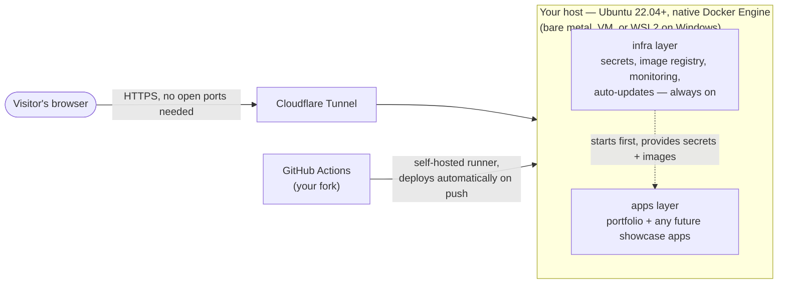

# Deployment Guide

This guide documents how to deploy the Systems Playground onto a self-managed Ubuntu host, leveraging automated startup scripts, Cloudflare Tunnels, and Watchtower for CI/CD.

**Who this is for:** you have (or are about to make) your own fork of this repo and want to deploy it as your own running instance. Every command below deploys *your* copy — nothing here talks to the original author's server.

**About the target host:** everything below is written for **any Ubuntu 22.04+ host** — bare metal, a VM, a cloud instance, or WSL2 on Windows. None of the core deployment steps (sections 0, 1, 3) are WSL-specific or Windows-specific at all — `bootstrap.sh` explicitly has no WSL branch, since WSL2 runs a real Linux kernel and installs everything the same way a native host does (see [ADR 003](adrs/003-native-docker-engine-over-docker-desktop.md)). Boot automation (section 2) is now `systemd`-based on **any** host type, WSL2 included — WSL2 has run real `systemd` as its init since it became the Ubuntu default, so it needs no special-casing here either. The one genuinely Windows-specific residue is making sure the WSL2 VM itself actually boots when Windows starts, since Windows has no native concept of "auto-start this Linux VM" — that's the one line item in the [Windows/WSL2-Specific Notes](#windowswsl2-specific-notes) section at the end. This project's own reference deployment happens to run on WSL2 (a NUC-class mini PC), which is why you'll see it mentioned as a concrete example throughout — but nothing here requires it.

## Before You Start

The big picture: your host runs everything. Nothing is exposed by opening router ports; a Cloudflare Tunnel makes an outbound-only connection from your host to Cloudflare, and Cloudflare routes public traffic back down that tunnel to whichever local port your service is listening on.


```mermaid
flowchart LR
    User(["Visitor's browser"]) -->|HTTPS, no open ports needed| CF["Cloudflare Tunnel"]
    CF --> Host

    subgraph Host["Your host — Ubuntu 22.04+, native Docker Engine<br/>(bare metal, VM, or WSL2 on Windows)"]
        direction TB
        Infra["infra layer<br/>secrets, image registry, monitoring,<br/>auto-updates — always on"]
        Apps["apps layer<br/>portfolio + any future showcase apps"]
        Infra -. starts first, provides secrets + images .-> Apps
    end

    GH["GitHub Actions<br/>(your fork)"] -->|self-hosted runner,<br/>deploys automatically on push| Host
```

**What you'll need before starting:**

- **An Ubuntu 22.04+ host.** Bare metal, a VM, a cloud instance, or WSL2 on Windows all work identically for sections 0, 1, and 3 below. If you're going the WSL2 route and haven't set it up yet, follow [Microsoft's official WSL install guide](https://learn.microsoft.com/en-us/windows/wsl/install) first — this doc picks up from there either way. No exact minimum hardware is specified in this repo, but the whole "scale-to-zero" design (see [ADR 001](../self-host/apps/portfolio/adrs/001-custom-go-control-plane.md)) exists specifically to keep steady-state resource use low, so modest hardware (a few GB of free RAM and disk) is enough to get started.
- **Your own fork of this repo** on GitHub (needed for section 3 — the CI/CD runner deploys from your fork, not the original).
- **A domain name you control, added to a free Cloudflare account.** You'll point subdomains of it at your services in section 1 — you can't complete that section without this.
- Comfort with a Linux terminal is helpful but not required — nearly every mechanical step is scripted (section 0).

With those in hand, follow sections 0 through 3 below in order — each one has a "✅ Verify this worked" checklist at the end before you move to the next.

## The host

Everything in this guide deploys onto **the host**: any Ubuntu 22.04+ machine — bare metal, a VM, a cloud instance, or WSL2 on Windows (this project's own reference host happens to be the latter, currently a NUC-class mini PC, but nothing below depends on that). Docker runs as a native Docker Engine installed directly on that host (see [ADR 003](adrs/003-native-docker-engine-over-docker-desktop.md) for why this isn't Docker Desktop's WSL2 integration on a Windows host), and a self-hosted GitHub Actions runner (a small agent that lets *your* GitHub Actions workflows run commands directly on your host — see section 3) also runs there. The rest of this doc just says "the host" from here on. If your host is Windows/WSL2 specifically, see [Windows/WSL2-Specific Notes](#windowswsl2-specific-notes) at the end of this doc for the handful of things that only apply to that setup.

## Architecture: `infra` vs `apps`
A robust local host environment separates core infrastructure from application workloads — this mirrors the in-repo split between `self-host/infra/` (platform-wide services) and `self-host/apps/` (showcase projects like the portfolio). This is the **deployed** layout on the host; two required repository variables control it, `INFRA_BASE_DIR` and `APP_BASE_DIR` — neither has a default, every deploy workflow fails fast if its own is unset.

```text
$INFRA_BASE_DIR (e.g. /home/yizhe/infra)          
├── wsl-startup.sh                                
├── wsl-shutdown.sh                                    
├── .env                                                
├── infisical/            (starts first — everything else depends on it for secrets)
│   └── docker-compose.yml
├── registry/             (starts second — services below pull their image from here)
│   └── docker-compose.yml
├── uptime-kuma/                                        
│   └── docker-compose.yml                              
├── watchtower/
│   └── docker-compose.yml
├── filebrowser/
│   └── docker-compose.yml
├── n8n/
│   └── docker-compose.yml
└── ...                   (any subdirectory with a docker-compose.yml is auto-discovered)

$APP_BASE_DIR (e.g. /home/yizhe/apps)
├── wsl-startup.sh
├── wsl-shutdown.sh
├── .env
├── portfolio/
│   ├── docker-compose.yml
│   ├── docker-compose.override.yml
│   ├── frontend/.env
│   └── backend/.env
└── ...                   (each future app gets its own top-level directory here)
```

*   **`$INFRA_BASE_DIR`**: platform-wide services — the secrets manager (`infisical`), the self-hosted image registry (`registry`), Cloudflare (`cloudflared`, installed directly on the host, not containerized), monitoring (`uptime-kuma`), auto-updates (`watchtower` — watches for newer container image versions and restarts affected services automatically), shared storage (`filebrowser`), automation (`n8n`), and whatever gets added next. `wsl-startup.sh`/`wsl-shutdown.sh` boot/stop this whole layer as a group and auto-discover new services by directory — nothing here needs to be registered by name, so this list will grow without needing a script change (see [the scripts README](../self-host/infra/scripts/README.md) for the two services that are special-cased for startup order, and why).
*   **`$APP_BASE_DIR`**: the actual showcase applications (`portfolio`, and any future ones — named after the app itself, e.g. `self-host/apps/<app-slug>`, not the `systems-playground` repo they all live in). These come online *after* the infra layer — its own `wsl-startup.sh`/`wsl-shutdown.sh` pair (deployed by `deploy-app-scripts.yml`, mirroring the infra layer's) auto-discovers and boots/stops every app the same way, ordered after infra by its own systemd unit (section 2). Every app container also carries `restart: unless-stopped` independently, which is what actually survives a Docker-daemon-only restart (no full reboot) without needing this script to run again.

**In-repo source of these files:** `wsl-startup.sh`/`wsl-shutdown.sh` live at `self-host/infra/scripts/`, copied flat into `$INFRA_BASE_DIR/` by `deploy-infra-scripts.yml`. Every other infra service's compose file is copied the same way by its own `deploy-infra-<slug>.yml` into `$INFRA_BASE_DIR/<slug>/`. The portfolio app's compose files are copied by `deploy-app-portfolio.yml` into `$APP_BASE_DIR/portfolio/` (from `self-host/apps/portfolio/` in the repo). There is no `/wsl-reference-setup` directory in this repo — `self-host/infra/` and `self-host/apps/` **are** the reference source.

---

## 0. Fresh Host Bootstrap

[`scripts/bootstrap.sh`](../scripts/bootstrap.sh) automates the mechanical, idempotent parts of getting a fresh Ubuntu-like host ready: installing `git`/`cloudflared` (and Docker Engine, on a native host — see below), cloning this repo, scaffolding `$INFRA_BASE_DIR`/`$APP_BASE_DIR`, and templating `~/.cloudflared/config.yml`. It's safe to re-run — every step checks current state first.

**Nothing needs to be cloned first.** The script clones the repo itself (step 4) if it isn't already present, so on a genuinely fresh host you can just download the one file and run it:

```bash
curl -fsSL -o bootstrap.sh https://raw.githubusercontent.com/yizhe1997/systems-playground/main/scripts/bootstrap.sh
REPO_URL=<your-fork-url> bash bootstrap.sh; rm -f bootstrap.sh   # REPO_URL defaults to yizhe1997/systems-playground if omitted
```

`rm -f bootstrap.sh` cleans up the standalone downloaded copy once it's done — `;` rather than `&&` so that happens whether the run succeeded, paused, or failed, not just on success. Safe to remove unconditionally: step 4 (cloning the repo) runs before any of the manual-step pauses below, so by the time there's anything to re-run, a real clone already exists at `$REPO_DIR` (default `~/systems-playground`) with its own copy of this same script inside it.

If you already have the repo cloned, `make bootstrap` from the repo root works the same way and reuses that clone instead of creating a second one.

It pauses with printed instructions at the steps below that genuinely need a human: `cloudflared tunnel login` (browser auth), `cloudflared tunnel create`, and GitHub Actions runner registration (needs a fresh token from GitHub's UI each time). **Re-run from the clone** after completing each one (`cd ~/systems-playground && make bootstrap`, or `bash scripts/bootstrap.sh` from inside it) — not by re-downloading the standalone file again, since it's already been removed and the cloned copy is the one that stays current via `git pull` anyway. Sections 1 and 3 below describe what those manual steps are doing; the script exists so you don't have to hand-run the surrounding mechanical parts (installing `cloudflared`, writing the skeleton `config.yml`, downloading the runner binary) yourself.

**Docker is conditional, not WSL-specific:** the script checks whether `docker` already works before installing anything; if it doesn't, it installs Docker Engine directly (the same steps as [Docker's official apt instructions](https://docs.docker.com/engine/install/ubuntu/)) regardless of whether the host is WSL2 or bare-metal Ubuntu — WSL2 runs a real Linux kernel, so there's no reason to special-case it. See [ADR 003](adrs/003-native-docker-engine-over-docker-desktop.md) for why this used to route WSL hosts to Docker Desktop instead, and the note above this section for a gotcha if this host previously relied on Docker Desktop's WSL integration.

**Also installs and enables the systemd units** covered in section 2 below (Docker's own unit, the infra-layer oneshot, and the cloudflared/cloudflared-sync user units) — gracefully skipped step by step until their prerequisites exist (a tunnel, a first CI deploy), so re-running this script after completing later sections is how those get picked up. See section 2 for what each one does.

Infisical's admin/org/machine-identity setup stays fully manual — see [`self-host/infra/infisical/README.md`](../self-host/infra/infisical/README.md#bootstrap-one-time-manual---cannot-be-automated-via-ci-since-nothing-else-can-authenticate-to-this-yet) for why it can't be scripted. On a WSL2 host, one Windows-side Task Scheduler entry also stays manual — see [Windows/WSL2-Specific Notes](#windowswsl2-specific-notes).

**✅ Verify this worked:** run `docker --version` and `cloudflared --version` — both should print a version, not "command not found". Run `ls ~/infra ~/apps` — both directories should exist (empty for now; they get populated by the deploy workflows in section 3). If `bootstrap.sh` paused with a manual-step message instead of finishing, that's expected — follow that message, then re-run the script.

---

## 1. Cloudflare Tunnel Setup

To expose your local services securely without opening router ports, we use Cloudflare Tunnels (`cloudflared`). This is the only reverse-proxy layer in front of services — there is no nginx (or similar) in the request path. Cloudflare Tunnel's `ingress` config already does hostname- and path-based routing straight to each service's `localhost:<port>`, which is sufficient on its own; adding nginx would just be a second, redundant routing layer. (This host happens to also have a system `nginx` package installed, but it's unconfigured/unused — serves only the stock placeholder page on port 80, which nothing points at — a leftover from an earlier, abandoned approach. Don't wire anything through it.)

1. **Install cloudflared:** `make bootstrap` does this for you (or follow the [official Cloudflare documentation](https://developers.cloudflare.com/cloudflare-one/connections/connect-networks/get-started/create-local-tunnel/) to install it manually).
2. **Authenticate:** Run `cloudflared tunnel login`.
3. **Create a Tunnel:** Run `cloudflared tunnel create <your-tunnel-name>`. This generates a JSON credentials file.
4. **Configure Routing:** `make bootstrap` templates a starter `config.yml` in `~/.cloudflared/` (tunnel id + credentials-file + a `cloudflared-sync` managed block + catch-all 404) once a tunnel exists — it never overwrites one that's already there.

### Two ways to add a service's route

**Automatic (recommended):** label the service in its `docker-compose.yml`, and [`cloudflared-sync.sh`](../self-host/infra/scripts/README.md#automatic-cloudflare-tunnel-routing) does the rest — adds the `ingress` entry *and* creates the Cloudflare DNS record, no manual file editing or dashboard visit needed:

```yaml
  frontend:
    ports:
      - "8081:3000"
    labels:
      - cloudflare.tunnel.hostname=portal.yourdomain.com
      - cloudflare.tunnel.port=8081
```

Opt-in — set `CLOUDFLARED_SYNC_ENABLED=true` (a repository variable, same mechanism as `TUNNEL_NAME`) to turn it on. Setting the variable alone doesn't start anything by itself: it only takes effect once `deploy-infra-scripts.yml` runs and writes it into `$INFRA_BASE_DIR/.env` (any push that workflow watches, or a manual **Run workflow**), *and* `bootstrap.sh` is re-run afterward to actually install and start `cloudflared-sync.service` (section 2) — re-running is safe and idempotent, it just checks current state and does nothing if there's nothing to do. See the linked doc for exactly how the sync logic itself works and what it won't touch.

**Manual:** still works for anything not label-driven — edit `~/.cloudflared/config.yml` directly, adding entries above the `# BEGIN cloudflared-sync managed block` marker or below the `# END` marker (never inside it, that section gets overwritten on the next automatic sync if it's enabled), then create the DNS record yourself: `cloudflared tunnel route dns <your-tunnel-name> <hostname>`.

```yaml
tunnel: <your-tunnel-id>
credentials-file: /home/user/.cloudflared/<your-tunnel-id>.json

ingress:
  # Example: Expose the Systems Playground API (manual entry)
  - hostname: api.yourdomain.com
    service: http://localhost:8085

  # BEGIN cloudflared-sync managed block - do not edit by hand, see self-host/infra/scripts/cloudflared-sync.sh
  - hostname: portal.yourdomain.com
    service: http://localhost:8081
  # END cloudflared-sync managed block
  - service: http_status:404
```

**✅ Verify this worked:** run `cloudflared tunnel list` — your tunnel name should appear. Run `cat ~/.cloudflared/config.yml` and confirm it has your tunnel's ID and at least the catch-all 404 entry. If you re-run `bootstrap.sh` now that `config.yml` exists, it installs and starts `cloudflared.service` (section 2) — `systemctl --user status cloudflared.service` should show it active, and `https://yourdomain.com` should start responding for any hostname already in `config.yml`. If you'd rather finish reading section 2 first before starting the tunnel process, that's fine too — nothing here requires it yet.

---

## 2. Automating Boot

`systemd` now owns the whole boot/shutdown lifecycle on any host type — Docker's own unit, the infra layer as a native oneshot, and `cloudflared`/`cloudflared-sync` as their own long-running, self-restarting units. `bootstrap.sh` (section 0) installs and enables all of it; this section explains what each piece does and, for WSL2 specifically, the one thing `systemd` genuinely can't do on its own.

Only the **infra** layer ships a startup/shutdown script pair in this repo (`self-host/infra/scripts/wsl-startup.sh` / `wsl-shutdown.sh`, deployed to `~/infra/`). It brings up every service under `~/infra/*/docker-compose.yml` (Infisical first since everything depends on it for secrets, then the self-hosted registry since services like n8n pull their image from it, then everything else). See [the scripts README](../self-host/infra/scripts/README.md) for the full ordering rationale. (Despite the `wsl-` prefix in the filenames — a holdover from when this repo only targeted WSL2 — the scripts themselves are plain bash with nothing WSL-specific in them; they run identically on native Ubuntu.)

### What `bootstrap.sh` installs

| Unit | Type | Runs as | What it does |
|---|---|---|---|
| `docker.service` | (Docker's own unit, not ours) | root | Enabled via `systemctl enable docker` — comes up on every boot, which is what actually makes the apps layer's `restart: unless-stopped` reliable (see "Reboot recovery" below) instead of depending on something else remembering to start the daemon first |
| `systems-playground-infra.service` | oneshot, `RemainAfterExit=yes` | root | `ExecStart=wsl-startup.sh` / `ExecStop=wsl-shutdown.sh` — brings up (or gracefully tears down) every service under `$INFRA_BASE_DIR/*/docker-compose.yml`, same ordering as above |
| `systems-playground-apps.service` | oneshot, `RemainAfterExit=yes` | root | `ExecStart=`/`ExecStop=` the apps layer's own `wsl-startup.sh`/`wsl-shutdown.sh` (`self-host/apps/scripts/`) — brings up (or gracefully tears down) every app under `$APP_BASE_DIR/*/docker-compose.yml`. Ordered `After=systems-playground-infra.service`, not `Requires=` it — preserves "infra boots first" without hard-blocking the apps layer if infra's oneshot happens to fail |
| `cloudflared.service` | simple, `Restart=always` | your host user | Runs the tunnel client itself. `Restart=always` matters: this used to be a bare `nohup` process with zero supervision, and it silently dying with nothing bringing it back until the next full reboot was a real incident this project hit, not a hypothetical |
| `cloudflared-sync.service` | simple, `Restart=always` | your host user | Opt-in (`CLOUDFLARED_SYNC_ENABLED=true`, section 1) — the label-watching loop. Same reasoning as above: it used to be an unsupervised background process with the identical "dies silently, nobody notices" gap |
| `systems-playground-infra-backup.service` + `.timer` | oneshot + `OnCalendar=daily` timer | root | Runs `wsl-backup.sh` for the infra layer once a day. `Persistent=true` on the timer catches up a missed run once the host is back, rather than skipping that day entirely |
| `systems-playground-apps-backup.service` + `.timer` | oneshot + `OnCalendar=daily` timer | root | Same, for the apps layer's own `wsl-backup.sh` |

`cloudflared.service`/`cloudflared-sync.service` are user-level units (`~/.config/systemd/user/`), not system units — both already run as your regular host user, and a user unit lets `cloudflared-sync.sh` restart `cloudflared.service` via `systemctl --user restart` with no `sudo`/polkit rule needed. `bootstrap.sh` also runs `loginctl enable-linger <user>` once, which is what makes user units start at boot even without an interactive login session — without it, they'd only start once you actually log in.

Source: [`self-host/infra/scripts/systemd/`](../self-host/infra/scripts/systemd/) for the infra-layer units (`cloudflared.service`, `cloudflared-sync.service`, `systems-playground-infra.service`, `systems-playground-infra-backup.service`/`.timer`), [`self-host/apps/scripts/systemd/`](../self-host/apps/scripts/systemd/) for the apps-layer ones (`systems-playground-apps.service`, `systems-playground-apps-backup.service`/`.timer`) — mirroring the infra/apps directory split used everywhere else in this repo. `bootstrap.sh` templates `<INFRA_BASE_DIR>`/`<APP_BASE_DIR>` in each before installing — nothing to edit by hand.

### If your host is native Ubuntu (bare metal or VM)

Nothing further to do — `systemd` is already your host's own init, so the units above start on every boot the moment `bootstrap.sh` has enabled them. No extra step, no Task Scheduler equivalent needed at all.

### If your host is Windows/WSL2

Same units, same behavior, once the WSL2 VM is actually running — this project's own reference host runs exactly this setup. The one thing `systemd` can't do for you: Windows has no native concept of auto-starting a WSL2 VM at boot, something external has to invoke `wsl.exe` at least once to wake it. That's Task Scheduler's **entire** remaining job here — it no longer runs your scripts directly, it just makes sure the VM (and its `systemd`, and everything `systemd` starts) exists.

1. Open **Task Scheduler** in Windows.
2. Click **Create Basic Task...**
3. **Name:** `WSL Startup`
4. **Trigger:** `When the computer starts`.
5. **Action:** `Start a program`
6. **Program/script:** `wsl.exe`
7. **Add arguments:** `-d Ubuntu -- true` — a trivial no-op; invoking `wsl.exe` at all is what boots the VM (and everything `systemd` starts inside it) as a side effect. Deliberately **not** `-u root -e bash wsl-startup.sh` anymore — that would just re-run the infra bring-up a second time on top of what `systems-playground-infra.service` already does natively.
8. **Check:** "Run with highest privileges" in the task properties.

**Shutdown:** nothing to configure — `systemd`'s own `ExecStop=wsl-shutdown.sh` on `systems-playground-infra.service` already runs on a graceful WSL2 shutdown, and `docker.service`/the cloudflared units stop the same way any `systemd` service does. If you're migrating an existing host from the old setup, remove any prior "WSL Shutdown" Task Scheduler entry (Event ID 1074) — it's redundant now and could race `systemd`'s own shutdown ordering.

**Reboot recovery:** every service in `self-host/apps/portfolio/docker-compose.yml` (backend, frontend, redis) is set to `restart: unless-stopped`. Since `docker.service` now reliably comes back on boot on its own, Docker brings these containers back the moment the daemon restarts — no explicit boot script needed for the apps layer, unlike infra. It also plays correctly with scale-to-zero: `unless-stopped` respects an explicit `docker stop` (i.e. one issued by the Go control plane's reaper — the background process that automatically stops idle demo containers to save RAM, see [ADR 001](../self-host/apps/portfolio/adrs/001-custom-go-control-plane.md)), so a container the reaper intentionally stopped for inactivity stays stopped across a reboot rather than snapping back on.

**✅ Verify this worked:** `systemctl status systems-playground-infra.service systems-playground-apps.service` (root) and `systemctl --user status cloudflared.service cloudflared-sync.service` should all show `active`. Run `docker ps` — you should see your infra containers (at minimum `infisical`, `registry`) *and* your apps (at minimum `portfolio`) listed as running. Run `cloudflared tunnel info <your-tunnel-name>` to confirm the tunnel shows an active connection. On WSL2, once the Task Scheduler entry above is in place, actually reboot Windows and repeat these checks afterward — confirming a manual `systemctl start` works isn't the same as confirming the whole chain survives a real reboot. If something's missing: `journalctl --user -u cloudflared.service -u cloudflared-sync.service` and `journalctl -u systems-playground-infra.service -u systems-playground-apps.service` (plus `~/infra/logs/wsl-startup.log` / `~/apps/logs/wsl-startup.log`) are where to look first.

---

## 3. Deploying Updates (Zero-Downtime CI/CD)

To ensure the portfolio is always up to date with the latest GitHub code, we use a **GitHub Actions Self-Hosted Runner** installed directly on the host. The runner triggers within seconds of a relevant push or build finishing on GitHub — it does not `git pull` the working tree; instead each deploy workflow checks out the repo fresh and copies only the files it needs (compose files, scripts) to a flat directory on the host, then writes `.env` files from GitHub Secrets/Variables before restarting containers.

The workflows involved, all under `.github/workflows/`:

| Workflow | Runs when | What it does |
|---|---|---|
| `build-app-portfolio-backend.yml` / `-frontend.yml`, `build-infra-n8n.yml` | Its own `backend/**` / `frontend/**` (portfolio) or `self-host/infra/n8n/**` changes | Builds and pushes an image to the self-hosted registry (see [ADR 002](adrs/002-infisical-secret-injection.md) for the secrets side of this) |
| `deploy-app-portfolio.yml` ("Instant Deploy (Self-Hosted)") | Either portfolio build workflow completes, or `self-host/apps/portfolio/**` changes | Copies `docker-compose.yml`/`docker-compose.prod.yml` (renamed to `docker-compose.override.yml`) into `$APP_BASE_DIR/portfolio`, writes `.env` files from Infisical-injected secrets, runs `docker compose pull && docker compose up -d` |
| `deploy-infra-n8n.yml` | `build-infra-n8n.yml` completes, or `self-host/infra/n8n/**` changes | Same pattern as `deploy-app-portfolio.yml`, for n8n |
| `deploy-app-scripts.yml` | `Test Apps Scripts` (`test-apps-scripts.yml`) passes on `main` | Copies `wsl-startup.sh`/`wsl-shutdown.sh`/`wsl-backup.sh` to `$APP_BASE_DIR` — gated on tests passing first, unlike most other rows here |
| `deploy-infra-scripts.yml` | `Test Infra Scripts` (`test-infra-scripts.yml`) passes on `main` | Same, to `$INFRA_BASE_DIR` — gated on tests passing first, unlike most other rows here |
| `deploy-infra-uptime-kuma.yml`, `deploy-infra-watchtower.yml`, `deploy-infra-filebrowser.yml`, `deploy-infra-infisical.yml`, `deploy-infra-registry.yml` | Its own `self-host/infra/<service>/**` changes | Copies that service's compose file to the host and restarts it |

Setup steps (`make bootstrap` downloads and extracts the runner binary for you — steps 1-2 and the `config.sh`/`svc.sh` commands in step 3 still require the GitHub UI and a fresh token, so stay manual):

1. Go to your GitHub Repository -> **Settings** -> **Actions** -> **Runners**.
2. Click **New self-hosted runner** and select Linux/x64.
3. SSH into your host, run the provided commands to download and configure the runner service.
   
   ⚠️ **IMPORTANT: HOW TO PREVENT THE RUNNER FROM DYING ON REBOOT** ⚠️
   When you install the GitHub Actions runner on your WSL/Linux host, DO NOT just run `./run.sh`. If your host restarts, the runner will die.
   To ensure the runner automatically starts every time the host boots:
   * CD into your actions-runner directory: `cd ~/actions-runner`
   * Install the background service: `sudo ./svc.sh install`
   * Start the background service: `sudo ./svc.sh start`

4. Go to your GitHub Repository -> **Settings** -> **Secrets and variables** -> **Actions** -> **Variables**, and create two repository variables: `INFRA_BASE_DIR` — where infra services deploy, e.g. `/home/yizhe/infra` — and `APP_BASE_DIR` — where showcase apps like the portfolio deploy, e.g. `/home/yizhe/apps`. Neither is where the repo is git-cloned; both are deploy targets. Every deploy workflow requires its own explicitly — none of them fall back to a baked-in default, so a missing variable fails the job immediately with a clear error instead of silently deploying somewhere unintended.

**⚠️ Security note:** this repo is public and the runner above is self-hosted — GitHub explicitly warns against that combination because a `pull_request`-triggered workflow can let a forked PR run untrusted code on your host before review. Current workflows avoid this (only `push`/`workflow_run`/`workflow_dispatch` trigger the self-hosted jobs), but that invariant must hold for any new workflow you add. See [`docs/adrs/001-cicd-secrets-and-runner-trust-boundary.md`](adrs/001-cicd-secrets-and-runner-trust-boundary.md) before adding a PR-triggered workflow or a second collaborator.

**ℹ️ Edge Case: What if the host is turned off during a push?**
*   **< 24 Hours Offline:** If you push code while the host is off, the deployment job will sit in a "Queued" state on GitHub. The moment the host boots up (and the runner service starts), it will instantly connect to GitHub, catch up, and execute the queued deployment.
*   **> 24 Hours Offline:** GitHub Actions cancels queued jobs after 24 hours. If the host is off for a week, you will need to manually trigger the deployment. Go to your repository's **Actions** tab -> **Instant Deploy (Self-Hosted)** -> click **Run workflow** to force the host to sync the latest code and images.

**✅ Verify this worked:** on GitHub, go to **Settings → Actions → Runners** — your runner should show as **Idle** with a green dot. Push a trivial change to a path one of the workflows in the table above watches (or use **Actions → Instant Deploy (Self-Hosted) → Run workflow** to trigger one manually) and confirm the run appears and finishes green. Once that's done, `$APP_BASE_DIR/portfolio` should be populated and `docker ps` should show the portfolio's containers running — visiting the hostname you configured in section 1's `config.yml` should now actually reach it.

---

## Windows/WSL2-Specific Notes

Everything above applies to any Ubuntu host. This section is the one place that collects things which only matter if your host specifically is Windows/WSL2 — if you're on bare metal or a VM, skip it.

**Boot automation** is `systemd` here too, same as any other host — Task Scheduler's only remaining job is waking the WSL2 VM itself at boot, since Windows has no native way to auto-start a Linux VM on its own. See the [Windows/WSL2 subsection of section 2](#if-your-host-is-windowswsl2) above.

**If this distro previously had Docker Desktop's "WSL Integration" toggle enabled for it:** disabling that toggle (or never having Docker Desktop at all) is the correct end state for this repo (see [ADR 003](adrs/003-native-docker-engine-over-docker-desktop.md) for why) — but if you're migrating an existing host away from that toggle, check `/usr/local/lib/docker/cli-plugins/` first. Docker Desktop's integration installs its CLI plugins (`docker compose`, `buildx`, etc.) there as symlinks pointing into Docker Desktop's own mount (`/mnt/wsl/docker-desktop/...`); those symlinks go dangling the moment integration is off, even though the native `dockerd` underneath is completely unaffected. Symptom looks like `docker: unknown command: docker compose`. Fix: move the stale directory aside (`sudo mv /usr/local/lib/docker/cli-plugins /usr/local/lib/docker/cli-plugins.bak-desktop`) and reinstall/confirm `docker-compose-plugin` via apt, which puts real (non-symlink) plugins back in that path. Docker Desktop itself can still be kept installed on Windows for other local dev work — just leave this distro's integration toggle off.

**Git Bash / MSYS2 quirks, if you ever run the test suite (`make test`) or scripts by hand from Git Bash on Windows itself** (as opposed to inside the WSL2 Ubuntu distro, which is what this whole guide otherwise assumes): Git Bash's MSYS2 layer mangles Docker volume-mount paths in `docker run -v host:/container` calls in two different ways depending on `MSYS_NO_PATHCONV`, and Git bind-mounting this repo into a test container can trip Git's dubious-ownership protection (CVE-2022-24765). `scripts/tests/*.bats` and `self-host/*/scripts/wsl-backup.sh` already work around both — see the comments at the top of `scripts/tests/test-bootstrap.bats`'s `setup_file()` and inside `wsl-backup.sh` for the specifics, if you're extending either.