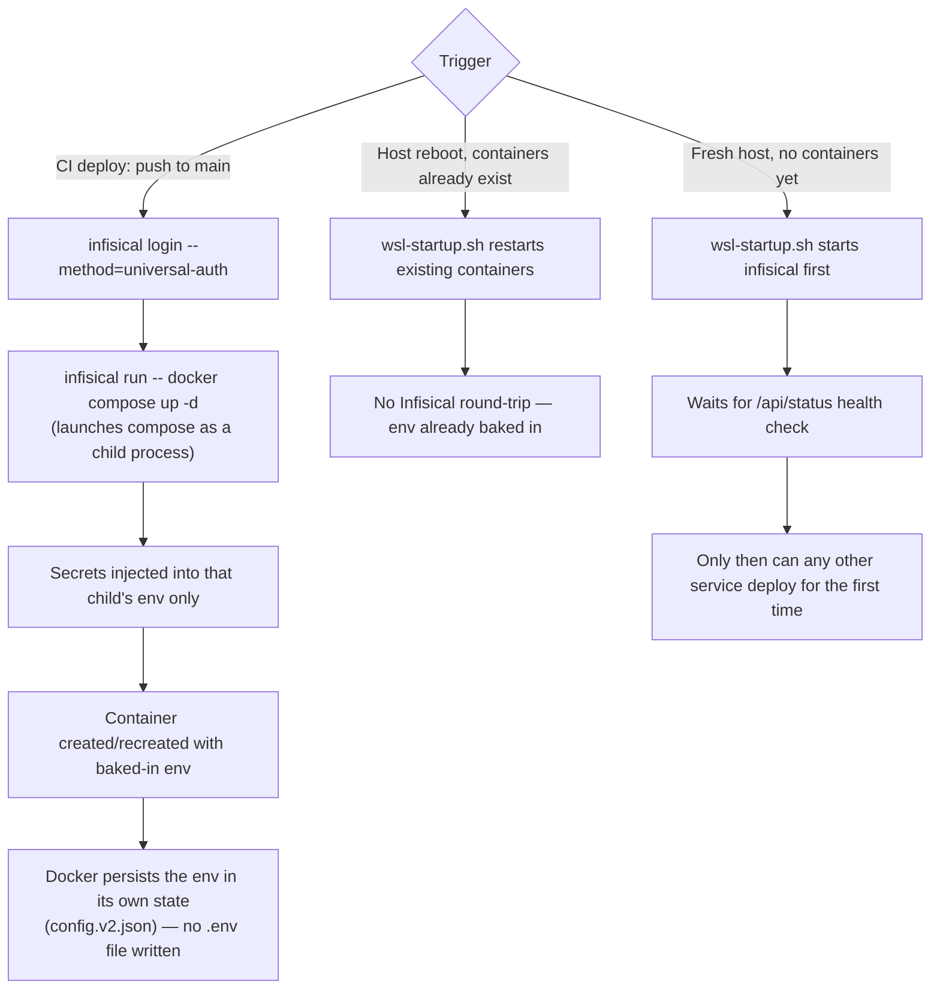

# ADR 002: Runtime Secret Injection via Infisical Instead of Plaintext `.env` Files

**Date:** 2026-07-11
**Status:** Accepted

### Context
Every deploy workflow today ([`deploy-app-portfolio.yml`](../../.github/workflows/deploy-app-portfolio.yml), [`deploy-infra-n8n.yml`](../../.github/workflows/deploy-infra-n8n.yml), [`deploy-infra-uptime-kuma.yml`](../../.github/workflows/deploy-infra-uptime-kuma.yml), [`deploy-infra-watchtower.yml`](../../.github/workflows/deploy-infra-watchtower.yml)) follows the same pattern: GitHub Actions secrets/vars are read into the job's environment, then written out with a shell heredoc — `cat <<EOF > "$TARGET/.env" ... EOF` — onto the self-hosted runner's disk, where `docker compose` reads them via `env_file: .env`.

That `.env` file is a permanent artifact. It sits on the host indefinitely after the deploy finishes, readable by anything with filesystem access to that path: another process on the host, a backup job that doesn't know to exclude it, a container that escapes its mount boundary, or simply the owner six months from now having forgotten it's there. Rotating a secret means re-running the deploy; the old plaintext copy isn't guaranteed to be overwritten cleanly, and there is no record of who or what read it in the meantime.

### Options Considered
1. **Keep the current pattern.** Zero migration cost, but every rotation stays manual (edit the value in GitHub's UI, re-deploy) and every secret still lands on disk as plaintext for as long as the host exists.
2. **Move secrets into self-hosted Infisical, fetched via `infisical run -- <command>` at deploy time.** Deploy workflows authenticate to Infisical with a single machine-identity token, and the CLI injects secrets directly into the *environment of the process it launches*, not into a file.
3. **Move to a heavier tool (Vault) with the same runtime-injection model.** Same benefit as Option 2, with more operational surface (unsealing, policy management) that isn't justified for this scale — see the earlier discussion of Infisical vs. Vault for this project.

### Decision
We chose **Option 2**.

### Reasoning: why environment injection avoids the disk-persistence problem
An environment variable is not a file — it's a key/value pair attached to a single running process's memory, inherited by whatever child processes that process spawns, and released back to the OS the moment the process exits. `infisical run -- docker compose up -d` works by: the CLI authenticates to the self-hosted Infisical instance, fetches the requested secrets over the network, and then **launches `docker compose up -d` itself as a child process**, injecting those values directly into that child's environment table — mechanically identical to typing `FOO=bar docker compose up -d` by hand. `docker compose` reads `FOO` from the process environment it inherited from its `infisical run` parent; it never touches a `.env` file, because none is written. Once that command exits, the environment holding those values is deallocated with the process. There is no artifact left on disk to `cat`, back up, sync, or leave exposed if the host is compromised later — the secret's lifetime is exactly the lifetime of the one command that needed it.

This directly addresses the two operational complaints that motivated the switch: rotation (change the value once in Infisical; every consumer picks it up on next deploy, instead of hand-editing GitHub Settings and hunting for every workflow that duplicates the value) and disk persistence.

**Important nuance on the disk-persistence claim, specific to `docker compose up -d`:** the "vanishes when the process exits" framing above is accurate for a genuine one-shot command, but `docker compose up -d` is not one — it creates a long-running container, and Docker itself persists that container's environment into its own daemon state (`/var/lib/docker/containers/<id>/config.v2.json`) so it can be restarted later without re-specifying it. So the values are not held in RAM only; they still land on disk. What actually changes is *where*: not a human-readable `.env` file sitting in the deploy directory next to the compose file (where anyone browsing the filesystem, backing up the directory, or reading the repo's deploy target would find it in plaintext), but inside Docker's own container metadata, gated behind the same access boundary as the Docker socket itself — already one of the most privileged things on this host. Meaningfully narrower exposure, not zero exposure. Worth being precise about this rather than overstating the guarantee.

**Boot-time implication:** Infisical only needs to be reachable at the moment a container is *created or recreated* — not on every boot, since values are baked in at creation time.

`wsl-startup.sh` starts `infisical` first and waits for its health check before anything else, covering both the fresh-host case and, defensively, any future service whose container entrypoint calls Infisical directly at startup rather than only at CI deploy time.

**Follow-up, closing a gap in the original implementation (2026-07-12):** the first version of `deploy-app-portfolio.yml` fetched secrets via `infisical run` but then *re-wrote* them to `$APP_DIR/.env`, `$APP_DIR/frontend/.env`, and `$APP_DIR/backend/.env` anyway, because `backend`/`frontend` used `env_file:` directives — which, unlike `environment:` with `${VAR}` interpolation, require an actual file on disk and cannot be satisfied by the invoking process's environment alone. This meant the disk-persistence problem was not actually solved for this app despite the secret *source* having changed. Fixed by switching `docker-compose.yml`/`docker-compose.prod.yml` to `environment:` blocks with `${VAR}` interpolation for every secret, and removing the three `.env` writes from the workflow entirely. The root `$APP_DIR/.env` (just `DOCKER_USERNAME`) was also removed — `${DOCKER_USERNAME}` in `docker-compose.prod.yml`'s image tag already resolves from the process environment without needing a file. Worth remembering as a general rule for any future migration: `infisical run` only removes the disk-persistence problem for services whose compose files use `environment:`/`${VAR}` — an `env_file:` directive defeats it regardless of where the values came from.

### Consequences
**Positive:**
- Secrets have a single source of truth (Infisical) instead of being duplicated across GitHub Secrets and multiple workflow `env:` blocks.
- Rotation becomes a one-place edit instead of a manual multi-file hunt.
- No plaintext secret material persists on the runner's disk after a deploy for any service migrated to this pattern.
- GitHub Secrets shrinks to one long-lived credential (`INFISICAL_TOKEN`) instead of a dozen-plus individual values.

**Negative / accepted tradeoffs:**
- Infisical's own bootstrap credentials (DB password, encryption key, auth secret — see [`.env.example`](../../self-host/infra/infisical/.env.example)) cannot themselves live in Infisical; this is an unavoidable root-of-trust problem shared by every secrets manager, and those specific values remain a plaintext `.env` on the runner, same as today. Everything *downstream* of Infisical being up is what moves out of plaintext.
- Adds a new always-on dependency (Infisical + its dedicated Postgres/Redis) that must be healthy before any other deploy workflow that depends on it can fetch secrets.
- One-time manual migration effort to re-enter existing secrets into Infisical (tracked separately, not automatable — nothing can authenticate to Infisical until it exists).
