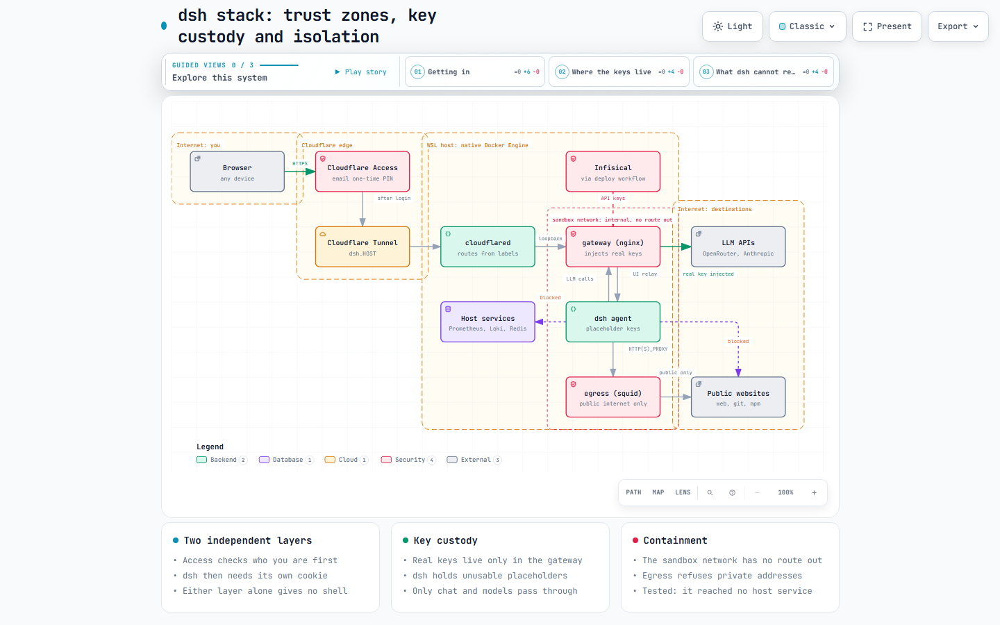
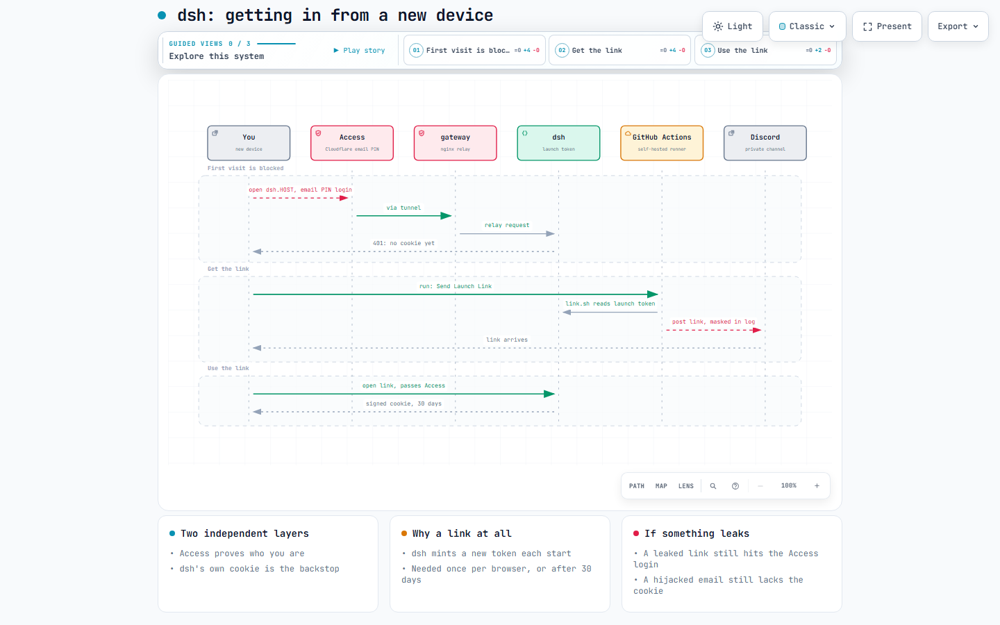

# ADR 004: Running an Agent Harness (dsh): Isolation, Key Custody and Access

**Date:** 2026-09-20
**Status:** Accepted

### Context
[DeepSeek Harness (`dsh`)](https://github.com/deepseek-ai/deepseek-harness) is a developer-preview agent that runs model-generated shell commands. Hosting it as infra (`self-host/infra/dsh/`) means giving a piece of software that can be steered by prompt injection three things: a shell, model-provider API keys, and a network position on a host that also runs Infisical, the image registry, n8n and the portfolio. It also has to be reachable from any of the owner's devices, not only the host.

Four findings, all verified rather than assumed, shaped the design:

1. **Environment variables are not a hiding place from the agent.** dsh scrubs credential-named variables from the environment of the commands it spawns, but a process running as the same user can still read another's environment from `/proc/<pid>/environ`. In a scratch container a same-user `cat` of PID 1's environment printed the API key variable. Any key placed in dsh's own container is readable by the agent.
2. **A normal container can reach everything published on the host.** On the WSL host's native Docker Engine (2026-09-20), a container on the default bridge reached Prometheus (9090), Loki (3100), cAdvisor (8082), the portfolio Redis (16379), the registry (5000), Infisical (8090) and the internet. Several of those are unauthenticated.
3. **dsh is loopback-first.** Its CLI refuses `--host 0.0.0.0`, its docs say authentication "does not imply supported network deployment, TLS, forwarding-header interpretation, or proxy configuration", and its session cookie has no `Secure` flag. Its own auth is a per-process launch token exchanged for a signed 30-day cookie, plus a Host/Origin fence on `/api`.
4. **The boot script would blank the keys.** `wsl-startup.sh` runs a bare `docker compose up -d` on every `*/docker-compose.yml` with no Infisical in the environment. For a compose file that interpolates secrets this recreates the container with empty values.

Interactive version: [`dsh-stack-trust-zones.html`](../diagrams/dsh-stack-trust-zones.html).

### Options Considered
1. **Run `npx @deepseek-ai/dsh web` directly on the host or in WSL.** Simplest. The agent then runs with the owner's Windows/WSL privileges, next to every secret and service. Rejected.
2. **One container, keys in its environment, published through the tunnel.** Fixes reachability only. Finding 1 makes the keys readable by the agent, and finding 2 leaves the host's services reachable. Rejected.
3. **A third-party image that adds a reverse proxy with HTTP Basic Auth.** Solves the loopback restriction, but the proxy holds dsh's launch token itself and auto-exchanges it, so one shared static password becomes the only protection, and with the password variables unset it runs with no auth at all. It also installs an unpinned `@next` and is unaudited. Rejected.
4. **Three containers with an isolated network, a key-injecting gateway and an egress proxy, behind Cloudflare Access.** Chosen.

### Decision
We chose **Option 4**, as five concrete rules:

1. **Isolation by network, not by trust.** `dsh` sits only on a Docker network created with `internal: true`, which has no route to the host, the LAN, other stacks or the internet. Its only neighbours are the two sidecars below.
2. **Keys live only in the gateway.** An nginx `gateway` container is the single published port (`127.0.0.1:3080`). It relays the UI to dsh over TCP and also serves as dsh's LLM endpoint: dsh is configured with `baseURL: http://gateway:8080/{openrouter,anthropic}` and placeholder keys, and the gateway injects the real key, verifies the upstream certificate, and forwards only the chat and models endpoints. Key-management and account endpoints are not reachable through it.
3. **One controlled way out.** A squid `egress` container is dsh's only route to the public internet (`HTTP(S)_PROXY`, honoured by dsh, git, npm and pip). It permits ports 80 and 443 and refuses loopback, RFC 1918, link-local (cloud metadata), CGNAT and multicast destinations, resolving names itself so a public name that points at a private address is refused too.
4. **Two independent access layers.** [Cloudflare Access](https://developers.cloudflare.com/cloudflare-one/access-controls/applications/http-apps/self-hosted-public-app/) (an email one-time-PIN policy for the owner only) is the identity layer. dsh's own signed cookie, minted from a launch link, is the backstop. Neither layer alone yields a shell.
5. **Publishing is opt-in.** The tunnel label is `${HOST:+${DSH_SUBDOMAIN:-dsh}.${HOST}}`, so nothing is routed until the `HOST` variable is set, and the Access application is created first.

Operationally:

- **Boot.** The workflow installs the file as `compose.yml`, not `docker-compose.yml`, so the boot script's glob skips it. `restart: unless-stopped` restores the existing containers with the environment baked in by the last deploy, which is the behaviour ADR 002 describes. `docker compose stop` is the kill switch.
- **Secrets** reach the gateway through `infisical run` at deploy time, per ADR 002. The gateway renders them onto tmpfs, so they exist only in that container's memory and environment.
- **Launch links** for a new browser are delivered on demand by a manual-dispatch workflow (`dsh-send-link.yml`) that reads the token from the container logs and posts it to a private Discord webhook. The link is masked in the public run log. It is delivered over GitHub and Discord rather than from a page behind Access so that the two layers stay independent: a design where Access alone hands out the token would collapse them into one.
- **Getting in** is shown below.

Interactive version: [`dsh-new-device-login.html`](../diagrams/dsh-new-device-login.html).

### Reasoning: what each control actually defends against
| Threat | Control | Verified how |
|---|---|---|
| Agent reads the API keys | Keys only in the gateway; dsh holds placeholders | Real key appears 0 times in dsh's container config or `/proc` environment; the upstream received the injected key from a real dsh chat request |
| Agent (or a prompt-injected page) reaches Infisical, the registry, Prometheus, Redis | Internal network | On the host's native engine: default-bridge control container reached all six services and the internet, the internal-network container reached none |
| Agent uses the egress proxy as a pivot to the host or LAN | Squid destination ACLs | Through the proxy: public 200; host services, `169.254.169.254`, LAN, loopback and non-80/443 ports refused |
| Stranger reaches the UI | Cloudflare Access, then dsh cookie | Unauthenticated request gets a 302 to the Access login; without a cookie dsh returns 401; forged Host/Origin get 403 |
| Stolen dsh cookie | Cookie is bound to the hostname it was minted for and needs Access to be reached | Cookie replayed on another authority gets 401 |
| Boot blanks the keys | `compose.yml` naming | Boot script glob analysis; not exercised across a real reboot |

### Consequences
**Positive:**
- A prompt-injected agent can burn credit but cannot exfiltrate the keys, and cannot touch any other service on the host.
- Publishing is a deliberate act with a written order (Access first, then the variable).
- No dependency on unaudited third-party images: all three images are built from this repo and pinned.

**Negative / accepted tradeoffs:**
- **Origin token verification is opt-in.** Cloudflare recommends that `cloudflared` validate the Access JWT so a request that bypasses Access is rejected. `cloudflared-sync.sh` now emits the per-rule `originRequest.access` block (`required`, `teamName`, `audTag`) for a container that carries both the `cloudflare.tunnel.access-team` and `cloudflare.tunnel.access-aud` labels, which dsh's compose sets from the `CF_ACCESS_TEAM` and `DSH_ACCESS_AUD` repository variables. Until they are set, if the Access application were deleted or mis-scoped, dsh's own launch-token/cookie is the only remaining gate. The label values are written into `config.yml`, so the script checks their shape (64 lowercase hex characters, a DNS-style team name) and refuses a half-set or malformed pair by leaving the hostname unrouted instead of publishing it without the check the owner asked for. It also runs `cloudflared tunnel ingress validate` on every regenerated config and keeps the previous one on failure, so a bad block cannot restart the shared tunnel into a crash loop. Covered by `scripts/tests/test-cloudflared-sync.bats`; the actual rejection of a token-less request by cloudflared is not exercised, since a bypassing request cannot be produced from outside.
- **The email one-time PIN is a single factor.** A Google identity provider with two-step verification would be stronger.
- **The agent can spend whatever credit the keys carry** and can read or write everything under `/workspace`. Dedicated, spend-limited keys are the cap.
- **Egress allows the whole public internet**, so workspace content could be sent anywhere. Turning it into an allowlist is one `squid.conf` change, at the cost of web fetch, `npm` and `git` working for arbitrary hosts.
- **The dsh cookie is a 30-day bearer** with no logout; revocation is deleting the signing record and restarting.
- **Not backed up.** `wsl-backup.sh` discovers services by the same glob, so `dsh_home` (settings, history) is not covered.
- **The launch link transits GitHub and Discord.** It is useless without also passing Access, and stops working when dsh next restarts, but it is reusable (not single-use) until then, so it is a credential and the Discord channel should be private.
- **Settings and model editing only work from a loopback page.** dsh's browser client enables host settings only when the page hostname is loopback; from `dsh.<HOST>` the provider directory fails with "settings are unavailable in this browser". Providers and models are therefore seeded (`settings.seed.yaml`) and otherwise edited through the loopback link on the host. Server-side there is no such check, so this is a client restriction of the pinned version, not a control this stack relies on.
- **Developer-preview software.** Compatibility-breaking releases are expected; the version is pinned in `self-host/infra/dsh/Dockerfile`.

### Related
- [ADR 001](./001-cicd-secrets-and-runner-trust-boundary.md): the link workflow is `workflow_dispatch`-only for the same reason as every self-hosted-runner workflow.
- [ADR 002](./002-infisical-secret-injection.md): key delivery and the boot-time behaviour this ADR relies on.
- [`self-host/infra/dsh/README.md`](../../self-host/infra/dsh/README.md): operating instructions, including the Cloudflare Access setup steps.
